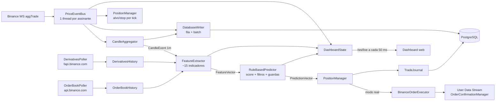

# BTC Trading Engine


Motor de trading em tempo real para **BTCUSDT** na Binance. Recebe cada negócio (`aggTrade`) por WebSocket, agrega candles de **1 minuto**, calcula indicadores técnicos, de fluxo, de price action e de derivativos, gera um sinal por regras (BUY / SELL / HOLD) e gerencia posições simuladas (paper trading) ou reais (Testnet/Mainnet). Tem dashboard web ao vivo e um endpoint de backtest sobre histórico real da Binance.

> **Aviso.** O preditor é **determinístico e heurístico**. `probabilityUp` e `probabilityDown` são uma sigmoide do score médio, não probabilidades calibradas. A vantagem medida em backtest é pequena (profit factor ≈ 1,04 em uma única janela de 90 dias). Não use com dinheiro real sem ler [docs/AUDITORIA.md](docs/AUDITORIA.md): o modo real tem falhas **críticas** ainda abertas.

---

## Sumário

- [Estado atual](#estado-atual)
- [Arquitetura geral](#arquitetura-geral)
- [Estrutura de pastas](#estrutura-de-pastas)
- [Tecnologias](#tecnologias)
- [Instalação](#instalação)
- [Execução](#execução)
- [Simulação e trading real](#simulação-e-trading-real)
- [Testes e CI](#testes-e-ci)
- [Documentação detalhada](#documentação-detalhada)
- [Limitações conhecidas](#limitações-conhecidas)

---

## Estado atual

| Item | Valor padrão |
| :--- | :--- |
| Mercado / timeframe | `BTCUSDT`, candles de **1m** (`market.interval.seconds=60`) |
| Períodos dos indicadores | Períodos clássicos de 15m multiplicados por 15 (ex.: RSI 14 → 210) |
| Modo | Simulação (`trading.real.enabled=false`) |
| Feed de preço e execução | Binance **Testnet** (`stream.testnet.binance.vision`, `testnet.binance.vision`) |
| Derivativos, order book, backtest | Binance **Mainnet** (dados públicos) |
| Regras que votam no score | RSI, distância da SMA, MACD, MFI |
| Filtros (veto de entrada) | ATR%, razão de volatilidade, ADX + largura de Bollinger |
| Filtros novos (desligados, não calibrados) | Gating por regime, guarda de VPIN, guarda de order book |
| Limiar de entrada | `avg ≥ 0,28` → BUY; `avg ≤ −0,28` → SELL; 2 candles de confirmação |
| Risco por posição | Alvo +2,0%, stop −1,5%, verificados a cada `aggTrade` |
| Persistência | PostgreSQL (ticks, candles, trades, execution_log, snapshots) |

## Arquitetura geral

O processo é um único JVM. `Main` monta o pipeline manualmente (sem injeção do Spring) e sobe um contexto Spring Boot só para o dashboard (REST + WebSocket).



Fluxo resumido:

1. **Aquecimento.** Na partida, carrega até 1000 candles fechados (REST da Binance, com fallback no PostgreSQL) e passa todos pelo `FeatureExtractor` sem gerar sinais.
2. **Ao vivo.** Cada `aggTrade` vai para o agregador, o banco, o gerenciador de posições (alvo/stop) e o dashboard.
3. **Fechamento do candle.** O `FeatureExtractor` gera um `FeatureVector`; o `RuleBasedPredictor` gera um `PredictionVector`; o `PositionManager` decide saída, reversão e entrada.
4. **Backtest.** `GET /api/backtest` baixa candles 1m da Mainnet, passa pelo mesmo `FeatureExtractor` e `RuleBasedPredictor` e simula as operações em `BacktestEngine`.

Detalhes em [docs/ARQUITETURA.md](docs/ARQUITETURA.md).

## Estrutura de pastas

```text
.
├── README.md                     # Este arquivo
├── SECURITY.md                   # Política de segurança
├── docker-compose.yml            # PostgreSQL 16
├── qodana.yaml                   # Análise estática (JetBrains Qodana)
├── .github/workflows/            # build.yml, test.yml, qodana_code_quality.yml
├── docs/                         # Documentação detalhada (ver índice abaixo)
└── btctradingengine/
    ├── pom.xml
    └── src/
        ├── main/java/dev/romeo/btctradingengine/
        │   ├── Main.java         # Ponto de entrada: monta e liga todo o pipeline
        │   ├── adapter/          # WebSocket aggTrade, klines REST, dumps aggTrades, agregador de candles, event bus
        │   ├── alerting/         # Alertas (Discord webhook)
        │   ├── backtest/         # BacktestEngine, BacktestRunner, BacktestParams, BacktestReport
        │   ├── config/           # Config: leitura estática de application.properties + validação
        │   ├── dashboard/        # Spring Boot: REST (/api), WebSocket (/ws/live), estado do dashboard
        │   ├── derivatives/      # Funding, open interest, long/short, basis (REST + dumps de métricas)
        │   ├── feature/          # FeatureExtractor e os grupos do FeatureVector
        │   ├── indicator/        # SMA, EMA, RSI, ATR, MACD, ADX, Bollinger, VWAP, MFI, Donchian, CVD, VPIN, absorção, price action
        │   ├── marketstate/      # (não usado)
        │   ├── model/            # Eventos: NormalizedPriceEvent, CandleEvent, TradeFlow, AggressorSide
        │   ├── orderbook/        # Polling de profundidade e imbalance por candle
        │   ├── persistence/      # HikariCP, schema, writers assíncronos e leitor de candles
        │   ├── prediction/       # RuleBasedPredictor, regime, guardas de entrada
        │   │   └── rules/        # RSI, SMA distance, MACD, MFI, ATR, Volatility, ADX regime
        │   └── trading/          # Posições, execução Binance, reconciliação, confirmação, portfólio, conectividade
        ├── main/resources/
        │   ├── application.properties
        │   ├── db-schema.sql
        │   └── static/           # index.html (dashboard), backtest.html
        └── test/java/...         # JUnit 5 (indicadores, regras, backtest, clientes, trading)
```

## Tecnologias

| Camada | Tecnologia | Uso |
| :--- | :--- | :--- |
| Linguagem | Java 25 | Records, pattern matching, `main` não público (JEP 512) |
| Build | Maven, Spotless (google-java-format, sem check no CI) | Compilação e empacotamento |
| Web | Spring Boot 3.5.5 (`starter-web`, `starter-websocket`) | REST, WebSocket e arquivos estáticos |
| JSON | Jackson | Parsing de mensagens da Binance e serialização |
| HTTP/WS cliente | `java.net.http.HttpClient` | REST e WebSocket da Binance |
| Banco | PostgreSQL 16, JDBC, HikariCP 5.1 | Persistência |
| Front-end | HTML/JS puro, Chart.js 4.4.4 (CDN), Google Fonts | Dashboard e tela de backtest |
| Alertas | Discord Webhook | Notificações críticas |
| Testes | JUnit Jupiter 5.11 | Testes unitários |
| Qualidade | GitHub Actions, JetBrains Qodana | Build, testes, análise estática |
| Infra local | Docker Compose | PostgreSQL |

APIs externas: Binance Spot (WS/REST, Testnet e Mainnet), Binance USD-M Futures (`fapi.binance.com`), `data.binance.vision` (dumps diários de aggTrades e métricas).

## Instalação

### Pré-requisitos

- **JDK 25** (Temurin ou equivalente). Com um JDK mais antigo a compilação falha com `release version 25 not supported`.
- **Maven 3.9+**
- **Docker** e **Docker Compose**
- Acesso de rede a `*.binance.com`, `*.binance.vision` e `fapi.binance.com` (quando bloqueado, desligue `derivatives.enabled` e `orderbook.enabled`)

### 1. Clonar

```bash
git clone git@github.com:joaocarlos2002/btc-trading-engine.git
cd btc-trading-engine
```

### 2. Alinhar banco e credenciais

> Hoje o `docker-compose.yml` e o `application.properties` **não batem**: o compose cria o banco `btc-trading-engine_btc` com o usuário `btc-trading-engine`, e a aplicação conecta em `polymarket_btc` com o usuário `polymarket`. Escolha um dos lados antes de subir.

Opção A, ajustar o compose ao `application.properties`:

```yaml
environment:
  POSTGRES_DB: polymarket_btc
  POSTGRES_USER: polymarket
  POSTGRES_PASSWORD: ${DB_PASSWORD}
healthcheck:
  test: ["CMD-SHELL", "pg_isready -U polymarket -d polymarket_btc"]
```

Opção B, sobrescrever `db.url`, `db.user` e `db.password` em `btctradingengine/src/main/resources/application.properties`.

Variáveis de ambiente lidas pelo código (têm precedência sobre o arquivo):

| Variável | Propriedade equivalente |
| :--- | :--- |
| `btc-trading-engine_DB_PASSWORD` | `db.password` |
| `btc-trading-engine_BINANCE_API_KEY` | `binance.api.key` |
| `btc-trading-engine_BINANCE_API_SECRET` | `binance.api.secret` |
| `btc-trading-engine_ALERT_DISCORD_WEBHOOK_URL` | `alert.discord.webhook.url` |

O hífen torna esses nomes impossíveis de exportar em bash/zsh (`export` recusa). No Linux, use `env 'btc-trading-engine_DB_PASSWORD=...' mvn ...`; no PowerShell, `[Environment]::SetEnvironmentVariable(...)`. A correção proposta está em [docs/AUDITORIA.md](docs/AUDITORIA.md) (item A6).

### 3. Subir o PostgreSQL

```bash
docker compose up -d postgres
docker compose ps        # aguarde "healthy"
```

As tabelas são criadas na partida (`db-schema.sql` + `TradeJournal`). Não há migrações versionadas.

## Execução

### Aplicação completa (pipeline + dashboard)

```bash
cd btctradingengine
mvn spring-boot:run -Dspring-boot.run.main-class=dev.romeo.btctradingengine.Main
```

- Dashboard: <http://localhost:8080>
- Backtest: <http://localhost:8080/backtest.html>
- API REST: <http://localhost:8080/api/...> (ver [docs/API.md](docs/API.md))

> Não use `java -jar target/*.jar` por enquanto. O `spring-boot-maven-plugin` não declara `mainClass`, e o único `public static void main` do projeto é o de `DashboardApplication`: o jar sobe só o dashboard, sem o pipeline de dados.

### Sequência de partida

1. `Config.validate()`: aborta com a propriedade inválida no erro.
2. Sobe o Spring (porta 8080) e cria/atualiza as tabelas.
3. Restaura a posição aberta e as últimas 500 fechadas do banco.
4. Em modo real: valida saldo USDT > 0 e filtros do símbolo, reconcilia com a Binance e conecta o User Data Stream.
5. Carrega derivativos e 1000 candles para aquecer os indicadores.
6. Inicia os pollers de derivativos e order book, o agregador e o WebSocket.

`Ctrl+C` dispara o shutdown hook: para o stream, esvazia a fila do banco e grava os trades.

### Backtest pela linha de comando

```bash
curl "http://localhost:8080/api/backtest?days=30"
curl "http://localhost:8080/api/backtest?days=90&buyThreshold=0.30&sellThreshold=-0.30&regimeGatingEnabled=true"
curl "http://localhost:8080/api/backtest?days=7&sizeSplit=true"   # baixa ~12 MB/dia de aggTrades
```

## Simulação e trading real

Em simulação, as posições existem só na memória e no banco, e o preço de entrada e saída é o fechamento do candle ou o preço do tick.

Para operar de verdade:

1. `trading.real.enabled=true`
2. Chaves da API (Testnet: <https://testnet.binance.vision>).
3. Para Mainnet, também `binance.rest.url=https://api.binance.com`, `binance.ws.url=wss://stream.binance.com:9443/ws/` e `trading.confirm.mainnet=true`. Sem essa confirmação a aplicação não sobe.
4. Saldo USDT positivo. Cada entrada usa **50% do saldo USDT**.

> Antes de habilitar, corrija os itens **C1 a C5** e **A1 a A3** de [docs/AUDITORIA.md](docs/AUDITORIA.md). Entre eles: a confirmação de ordem zera a quantidade da posição (a saída real nunca é enviada), a reconciliação não recupera a quantidade após reinício, os endpoints de ordem manual não têm autenticação e um sinal SELL no spot tenta vender BTC que o bot não tem.

## Testes e CI

```bash
cd btctradingengine
mvn test
```

GitHub Actions em PRs para `main` e `dev`: `build.yml` (`mvn clean package -DskipTests`) e `test.yml` (`mvn test`), ambos com Temurin 25. O `qodana_code_quality.yml` roda em PRs e em pushes para `main`/`develop`.

## Documentação detalhada

| Arquivo | Conteúdo |
| :--- | :--- |
| [docs/ARQUITETURA.md](docs/ARQUITETURA.md) | Componentes, threads, sequência de partida, fluxos de dados |
| [docs/REGRAS_NEGOCIO_DADOS.md](docs/REGRAS_NEGOCIO_DADOS.md) | Ingestão, agregação de candles, aquecimento, derivativos, order book |
| [docs/REGRAS_NEGOCIO_PREDICAO.md](docs/REGRAS_NEGOCIO_PREDICAO.md) | Regras, score, confirmação, filtros, regime e guardas |
| [docs/REGRAS_NEGOCIO_TRADING.md](docs/REGRAS_NEGOCIO_TRADING.md) | Posições, alvo/stop, reversão, execução real, reconciliação, riscos |
| [docs/REGRAS_NEGOCIO_BACKTEST.md](docs/REGRAS_NEGOCIO_BACKTEST.md) | Motor de backtest e diferenças em relação ao ao vivo |
| [docs/INDICADORES_TECNICOS.md](docs/INDICADORES_TECNICOS.md) | Fórmulas de SMA, EMA, RSI, ATR, MACD, ADX, Bollinger, VWAP, MFI, Donchian |
| [docs/INDICADORES_FLUXO_DERIVATIVOS_PRICE_ACTION.md](docs/INDICADORES_FLUXO_DERIVATIVOS_PRICE_ACTION.md) | CVD, VPIN, absorção, order book, derivativos, price action, features básicas |
| [docs/METRICAS_DESEMPENHO.md](docs/METRICAS_DESEMPENHO.md) | KPIs do backtest, do dashboard, do relatório de testnet e do portfólio |
| [docs/API.md](docs/API.md) | Endpoints REST e mensagens WebSocket |
| [docs/BANCO_DE_DADOS.md](docs/BANCO_DE_DADOS.md) | Tabelas, índices, escrita e leitura |
| [docs/CONFIGURACAO.md](docs/CONFIGURACAO.md) | Todas as propriedades, padrões e validações |
| [docs/AUDITORIA.md](docs/AUDITORIA.md) | Bugs, falhas de segurança e gargalos, com correções |
| [docs/RECOMENDACOES_TECNOLOGICAS.md](docs/RECOMENDACOES_TECNOLOGICAS.md) | Tecnologias e padrões sugeridos para as próximas fases |

## Limitações conhecidas

- **Um símbolo por processo.** `Config` é estático, e vários componentes leem o símbolo global.
- **Sem venda a descoberto real.** O sinal SELL abre "short" na simulação, mas o mercado spot não permite isso.
- **Order book só ao vivo.** Não há histórico gratuito, e o guarda de order book não pode ser validado em backtest.
- **Filtros novos não calibrados.** Regime, VPIN e order book vêm desligados, com limites provisórios.
- **Mistura Testnet/Mainnet.** O preço ao vivo vem da Testnet, mas derivativos, basis e order book vêm da Mainnet.
- **Stop sem ordem na corretora.** Com o bot fora do ar, não existe proteção do lado da corretora.

Licença: ver [LICENSE](LICENSE).
