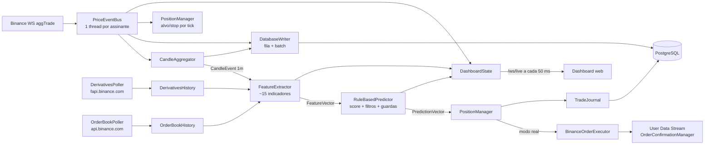

# BTC Trading Engine


Motor de trading em tempo real para **BTCUSDT** na Binance. Recebe cada negócio (`aggTrade`) por WebSocket, agrega candles de **1 minuto**, calcula indicadores técnicos, de fluxo, de price action e de derivativos, gera um sinal por regras (BUY / SELL / HOLD) e gerencia posições simuladas (paper trading) ou reais (Testnet/Mainnet). Tem dashboard web ao vivo e um endpoint de backtest sobre histórico real da Binance.

> **Aviso.** O preditor é **determinístico e heurístico**. `probabilityUp` e `probabilityDown` são uma sigmoide do score médio, não probabilidades calibradas. A vantagem medida em backtest é pequena (profit factor ≈ 1,04 em uma única janela de 90 dias). Não use com dinheiro real sem ler [docs/AUDITORIA.md](docs/AUDITORIA.md): o modo real tem falhas **críticas** ainda abertas.

---

## Sumário

- [Estado atual](#estado-atual)
- [Arquitetura geral](#arquitetura-geral)
- [Estrutura de pastas](#estrutura-de-pastas)
- [Tecnologias](#tecnologias)
- [Instalação](#instalação)
- [Execução](#execução)
- [Simulação e trading real](#simulação-e-trading-real)
- [Testes e CI](#testes-e-ci)
- [Documentação detalhada](#documentação-detalhada)
- [Limitações conhecidas](#limitações-conhecidas)

---

## Estado atual

| Item | Valor padrão |
| :--- | :--- |
| Mercado / timeframe | `BTCUSDT`, candles de **1m** (`market.interval.seconds=60`) |
| Períodos dos indicadores | Períodos clássicos de 15m multiplicados por 15 (ex.: RSI 14 → 210) |
| Modo | Simulação (`trading.real.enabled=false`) |
| Execução (ordens, user data stream) | Binance **Testnet** (`binance.ws.url`, `binance.rest.url`) |
| Feed de preço (ticks, warmup), derivativos, order book, backtest | Binance **Mainnet** (dados públicos; `market.data.ws.url`, `market.data.rest.url`) |
| Regras que votam no score | RSI, distância da SMA, MACD, MFI |
| Filtros (veto de entrada) | ATR%, razão de volatilidade, ADX + largura de Bollinger |
| Filtros novos (desligados, não calibrados) | Gating por regime, guarda de VPIN, guarda de order book |
| Limiar de entrada | `avg ≥ 0,28` → BUY; `avg ≤ −0,28` → SELL; 2 candles de confirmação |
| Risco por posição | Alvo +2,0%, stop −1,5%, verificados a cada `aggTrade` |
| Persistência | PostgreSQL (ticks, candles, trades, execution_log, snapshots) |

## Arquitetura geral

O processo é um único JVM. `Main` monta o pipeline manualmente (sem injeção do Spring) e sobe um contexto Spring Boot só para o dashboard (REST + WebSocket).



Fluxo resumido:

1. **Aquecimento.** Na partida, carrega até 1000 candles fechados (REST da Binance, com fallback no PostgreSQL) e passa todos pelo `FeatureExtractor` sem gerar sinais.
2. **Ao vivo.** Cada `aggTrade` vai para o agregador, o banco, o gerenciador de posições (alvo/stop) e o dashboard.
3. **Fechamento do candle.** O `FeatureExtractor` gera um `FeatureVector`; o `RuleBasedPredictor` gera um `PredictionVector`; o `PositionManager` decide saída, reversão e entrada.
4. **Backtest.** `GET /api/backtest` baixa candles 1m da Mainnet, passa pelo mesmo `FeatureExtractor` e `RuleBasedPredictor` e simula as operações em `BacktestEngine`.

## Estrutura de pastas

```text
.
├── README.md                     # Este arquivo
├── SECURITY.md                   # Política de segurança
├── docker-compose.yml            # PostgreSQL 16
├── qodana.yaml                   # Análise estática (JetBrains Qodana)
├── .github/workflows/            # build.yml, test.yml, qodana_code_quality.yml
├── docs/                         # Documentação detalhada (ver índice abaixo)
└── btctradingengine/              # Raiz do reactor Maven (issue #133)
    ├── pom.xml                   # packaging pom, ${revision}, BOM do Spring Boot
    ├── engine-core/              # Sem Spring, JDBC ou HTTP: model, indicator, feature, prediction (+ rules), port, marketstate
    ├── engine-data/              # adapter (WebSocket, klines, event bus, agregador), derivatives, orderbook,
    │                             # persistence (writers, leitores, retenção de ticks), alerting; db/migration (Flyway)
    ├── engine-trading/           # trading (posições, execução, reconciliação, guardas, TradeJournal),
    │                             # replay determinístico, JdbcOrderCommandStore
    ├── engine-backtest/          # BacktestEngine, BacktestRunner, BacktestParams, sweep, walk-forward, BacktestService
    └── engine-app/               # Spring Boot: Main, LivePipeline, config/ (*Properties validados), dashboard/,
                                  # BinanceBacktestDataLoader, ReplayRunner; application*.properties, static/
                                  # Único módulo com spring-boot-maven-plugin: gera o jar executável
```

## Tecnologias

| Camada | Tecnologia | Uso |
| :--- | :--- | :--- |
| Linguagem | Java 25 | Records, pattern matching, `main` não público (JEP 512) |
| Build | Maven, Spotless (google-java-format, sem check no CI) | Compilação e empacotamento |
| Web | Spring Boot 3.5.5 (`starter-web`, `starter-websocket`) | REST, WebSocket e arquivos estáticos |
| JSON | Jackson | Parsing de mensagens da Binance e serialização |
| HTTP/WS cliente | `java.net.http.HttpClient` | REST e WebSocket da Binance |
| Banco | PostgreSQL 16, JDBC, HikariCP 5.1 | Persistência |
| Front-end | HTML/JS puro, Chart.js 4.4.4 (CDN), Google Fonts | Dashboard e tela de backtest |
| Alertas | Discord Webhook | Notificações críticas |
| Testes | JUnit Jupiter 5.11 | Testes unitários |
| Qualidade | GitHub Actions, JetBrains Qodana | Build, testes, análise estática |
| Infra local | Docker Compose | PostgreSQL |

APIs externas: Binance Spot (WS/REST, Testnet e Mainnet), Binance USD-M Futures (`fapi.binance.com`), `data.binance.vision` (dumps diários de aggTrades e métricas).

## Instalação

### Pré-requisitos

- **JDK 25** (Temurin ou equivalente). Com um JDK mais antigo a compilação falha com `release version 25 not supported`.
- **Maven 3.9+**
- **Docker** e **Docker Compose**
- Acesso de rede a `*.binance.com`, `*.binance.vision` e `fapi.binance.com` (quando bloqueado, desligue `derivatives.enabled` e `orderbook.enabled`)

### 1. Clonar

```bash
git clone git@github.com:joaocarlos2002/btc-trading-engine.git
cd btc-trading-engine
```

### 2. Alinhar banco e credenciais

> Hoje o `docker-compose.yml` e o `application.properties` **não batem**: o compose cria o banco `btc-trading-engine_btc` com o usuário `btc-trading-engine`, e a aplicação conecta em `polymarket_btc` com o usuário `polymarket`. Escolha um dos lados antes de subir.

Opção A, ajustar o compose ao `application.properties`:

```yaml
environment:
  POSTGRES_DB: polymarket_btc
  POSTGRES_USER: polymarket
  POSTGRES_PASSWORD: ${DB_PASSWORD}
healthcheck:
  test: ["CMD-SHELL", "pg_isready -U polymarket -d polymarket_btc"]
```

Opção B, sobrescrever `db.url`, `db.user` e `db.password` em `btctradingengine/engine-app/src/main/resources/application.properties`.

Variáveis de ambiente lidas pelo código (têm precedência sobre o arquivo):

| Variável | Propriedade equivalente |
| :--- | :--- |
| `btc-trading-engine_DB_PASSWORD` | `db.password` |
| `btc-trading-engine_BINANCE_API_KEY` | `binance.api.key` |
| `btc-trading-engine_BINANCE_API_SECRET` | `binance.api.secret` |
| `btc-trading-engine_ALERT_DISCORD_WEBHOOK_URL` | `alert.discord.webhook.url` |

O hífen torna esses nomes impossíveis de exportar em bash/zsh (`export` recusa). No Linux, use `env 'btc-trading-engine_DB_PASSWORD=...' mvn ...`; no PowerShell, `[Environment]::SetEnvironmentVariable(...)`.

### 3. Subir o PostgreSQL

```bash
docker compose up -d postgres
docker compose ps        # aguarde "healthy"
```

O schema é versionado com Flyway (issue #102): as migrações ficam em `engine-data/src/main/resources/db/migration` (`V1__baseline.sql`, depois `V2__...`) e são aplicadas na partida, antes dos beans do pipeline que escrevem no banco. Com `engine.pipeline.enabled=false` (só dashboard) e no `ReplayRunner` nada é migrado. Um banco criado antes do Flyway (pelo antigo `db-schema.sql` + DDL do `TradeJournal`) é registrado como versão 1 (*baseline*, sem rodar o V1) e recebe só V2 em diante — desde que tenha sido iniciado ao menos uma vez pela última versão sem Flyway. Nunca edite uma migração já publicada; crie a próxima versão.

## Execução

### Aplicação completa (pipeline + dashboard)

```bash
cd btctradingengine
mvn -B package -DskipTests
java -jar engine-app/target/engine-app-*.jar
# ou, sem gerar o jar:
mvn install -DskipTests && mvn -pl engine-app spring-boot:run
```

Perfis opcionais: `SPRING_PROFILES_ACTIVE=testnet` ou `mainnet` (só apontam a execução; `trading.confirm.mainnet=true` continua obrigatório para operar na Mainnet). `engine.pipeline.enabled=false` sobe só o dashboard e os backtests.

- Dashboard: <http://localhost:8080>
- Backtest: <http://localhost:8080/backtest.html>
- API REST: <http://localhost:8080/api/...>

> O jar tem um único ponto de entrada (`Main`, declarado no `spring-boot-maven-plugin` do `engine-app`) e sobe o pipeline completo junto com o dashboard (issue #77).

### Sequência de partida

1. Binding e validação dos records `@ConfigurationProperties` (Bean Validation + `StartupSettingsValidator`): aborta com a propriedade inválida no erro.
2. Sobe o Spring (porta 8080) e cria/atualiza as tabelas.
3. Restaura a posição aberta e as últimas 500 fechadas do banco.
4. Em modo real: valida saldo USDT > 0 e filtros do símbolo, reconcilia com a Binance e conecta o User Data Stream.
5. Carrega derivativos e 1000 candles para aquecer os indicadores.
6. Inicia os pollers de derivativos e order book, o agregador e o WebSocket.

`Ctrl+C` fecha o contexto Spring, e `LivePipeline.close()` para o stream, esvazia a fila do banco e grava os trades.

### Backtest pela linha de comando

```bash
curl "http://localhost:8080/api/backtest?days=30"
curl "http://localhost:8080/api/backtest?days=90&buyThreshold=0.30&sellThreshold=-0.30&regimeGatingEnabled=true"
curl "http://localhost:8080/api/backtest?days=7&sizeSplit=true"   # baixa ~12 MB/dia de aggTrades
```

## Simulação e trading real

Em simulação, as posições existem só na memória e no banco, e o preço de entrada e saída é o fechamento do candle ou o preço do tick.

Para operar de verdade:

1. `trading.real.enabled=true`
2. Chaves da API (Testnet: <https://testnet.binance.vision>).
3. Para Mainnet, também `binance.rest.url=https://api.binance.com`, `binance.ws.url=wss://stream.binance.com:9443/ws/` e `trading.confirm.mainnet=true`. Sem essa confirmação a aplicação não sobe. O feed de preço (`market.data.*`) já é Mainnet em qualquer caso.
4. Saldo USDT positivo. Cada entrada usa **50% do saldo USDT**.

## Testes e CI

```bash
cd btctradingengine
mvn test                    # todos os módulos
mvn -pl engine-core test    # indicadores, features e regras, sem banco nem rede
```

GitHub Actions em PRs para `main` e `dev`: `build.yml` (`mvn clean package -DskipTests`, na raiz do reactor) e `test.yml` (`mvn test`), ambos com Temurin 25. O `qodana_code_quality.yml` roda em PRs e em pushes para `main`/`develop`.

## Limitações conhecidas

- **Um símbolo por processo.** Os componentes recebem `market.symbol` por construtor, mas o contexto monta um único pipeline.
- **Sem venda a descoberto real.** O sinal SELL abre "short" na simulação, mas o mercado spot não permite isso.
- **Order book só ao vivo.** Não há histórico gratuito, e o guarda de order book não pode ser validado em backtest.
- **Filtros novos não calibrados.** Regime, VPIN e order book vêm desligados, com limites provisórios.
- **Mistura Testnet/Mainnet.** O preço ao vivo vem da Testnet, mas derivativos, basis e order book vêm da Mainnet.
- **Stop sem ordem na corretora.** Com o bot fora do ar, não existe proteção do lado da corretora.

Licença: ver [LICENSE](LICENSE).
