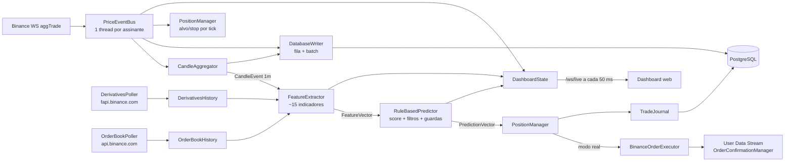

# BTC Trading Engine


Motor de trading em tempo real para **BTCUSDT** na Binance. Recebe cada negócio (`aggTrade`) por WebSocket, agrega candles de **1 minuto**, calcula indicadores técnicos, de fluxo, de price action e de derivativos, gera um sinal por regras (BUY / SELL / HOLD) e gerencia posições simuladas (paper trading) ou reais (Testnet/Mainnet). Tem dashboard web ao vivo e um endpoint de backtest sobre histórico real da Binance.

> **Aviso.** O preditor é **determinístico e heurístico**. `probabilityUp` e `probabilityDown` são uma sigmoide do score médio, não probabilidades calibradas. A vantagem medida em backtest é pequena (profit factor ≈ 1,04 em uma única janela de 90 dias).

---

## Sumário

- [Estado atual](#estado-atual)
- [Arquitetura geral](#arquitetura-geral)
- [Estrutura de pastas](#estrutura-de-pastas)
- [Tecnologias](#tecnologias)
- [Instalação](#instalação)
- [Execução](#execução)
- [Simulação e trading real](#simulação-e-trading-real)
- [Testes e CI](#testes-e-ci)
- [Documentação detalhada](#documentação-detalhada)
- [Limitações conhecidas](#limitações-conhecidas)

---

## Estado atual

| Item | Valor padrão |
| :--- | :--- |
| Mercado / timeframe | `BTCUSDT`, candles de **1m** (`market.interval.seconds=60`) |
| Períodos dos indicadores | Períodos clássicos de 15m multiplicados por 15 (ex.: RSI 14 → 210) |
| Modo | Simulação (`trading.real.enabled=false`) |
| Execução (ordens, user data stream) | Binance **Testnet** (`binance.ws.url`, `binance.rest.url`) |
| Feed de preço (ticks, warmup), derivativos, order book, backtest | Binance **Mainnet** (dados públicos; `market.data.ws.url`, `market.data.rest.url`) |
| Regras que votam no score | RSI, distância da SMA, MACD, MFI |
| Filtros (veto de entrada) | ATR%, razão de volatilidade, ADX + largura de Bollinger |
| Filtros novos (desligados, não calibrados) | Gating por regime, guarda de VPIN, guarda de order book |
| Limiar de entrada | `avg ≥ 0,28` → BUY; `avg ≤ −0,28` → SELL; 2 candles de confirmação |
| Risco por posição | Alvo +2,0%, stop −1,5%, verificados a cada `aggTrade` |
| Persistência | PostgreSQL (ticks, candles, trades, execution_log, snapshots) |

## Arquitetura geral

O processo é um único JVM. `Main` monta o pipeline manualmente (sem injeção do Spring) e sobe um contexto Spring Boot só para o dashboard (REST + WebSocket).



Fluxo resumido:

1. **Aquecimento.** Na partida, carrega até 1000 candles fechados (REST da Binance, com fallback no PostgreSQL) e passa todos pelo `FeatureExtractor` sem gerar sinais.
2. **Ao vivo.** Cada `aggTrade` vai para o agregador, o banco, o gerenciador de posições (alvo/stop) e o dashboard.
3. **Fechamento do candle.** O `FeatureExtractor` gera um `FeatureVector`; o `RuleBasedPredictor` gera um `PredictionVector`; o `PositionManager` decide saída, reversão e entrada.
4. **Backtest.** `GET /api/backtest` baixa candles 1m da Mainnet, passa pelo mesmo `FeatureExtractor` e `RuleBasedPredictor` e simula as operações em `BacktestEngine`.

## Estrutura de pastas

```text
.
├── README.md                     # Este arquivo
├── SECURITY.md                   # Política de segurança
├── docker-compose.yml            # PostgreSQL 16
├── qodana.yaml                   # Análise estática (JetBrains Qodana)
├── .github/workflows/            # build.yml, test.yml, qodana_code_quality.yml
├── docs/                         # Documentação detalhada (ver índice abaixo)
└── btctradingengine/              # Raiz do reactor Maven (issue #133)
    ├── pom.xml                   # packaging pom, ${revision}, BOM do Spring Boot
    ├── engine-core/              # Sem Spring, JDBC ou HTTP: model, indicator, feature, prediction (+ rules), port, marketstate
    ├── engine-data/              # adapter (WebSocket, klines, event bus, agregador), derivatives, orderbook,
    │                             # persistence (writers, leitores, retenção de ticks), alerting; db/migration (Flyway)
    ├── engine-trading/           # trading (posições, execução, reconciliação, guardas, TradeJournal),
    │                             # replay determinístico, JdbcOrderCommandStore
    ├── engine-backtest/          # BacktestEngine, BacktestRunner, BacktestParams, sweep, walk-forward, BacktestService
    ├── engine-web/               # Dashboard Angular (issue #134); com -P frontend vira static/ dentro do jar
    └── engine-app/               # Spring Boot: Main, LivePipeline, config/ (*Properties validados), dashboard/,
                                  # BinanceBacktestDataLoader, ReplayRunner; application*.properties
                                  # Único módulo com spring-boot-maven-plugin: gera o jar executável
```

## Tecnologias

| Camada | Tecnologia | Uso |
| :--- | :--- | :--- |
| Linguagem | Java 25 | Records, pattern matching, `main` não público (JEP 512) |
| Build | Maven Wrapper (Maven 3.9.16), Spotless (google-java-format), Docker multi-stage | Compilação e empacotamento |
| Web | Spring Boot 3.5.5 (`starter-web`, `starter-websocket`) | REST, WebSocket e arquivos estáticos |
| JSON | Jackson | Parsing de mensagens da Binance e serialização |
| HTTP/WS cliente | `java.net.http.HttpClient` | REST e WebSocket da Binance |
| Banco | PostgreSQL 16, JDBC, HikariCP 5.1 | Persistência |
| Front-end | Angular 22 (standalone, signals, sem zone.js), RxJS, Lightweight Charts, Chart.js, Inter e JetBrains Mono (locais) | Dashboard ao vivo, backtest e login (`engine-web`) |
| Alertas | Discord Webhook | Notificações críticas |
| Testes | JUnit Jupiter 5.11 | Testes unitários |
| Qualidade | GitHub Actions, Checkstyle, JaCoCo, ArchUnit, SpotBugs + find-sec-bugs, Error Prone + NullAway, OWASP Dependency-Check, Dependabot, JMH, Qodana | Build, testes, análise estática |
| Infra local | Docker Compose | PostgreSQL e a aplicação (`app`) |

APIs externas: Binance Spot (WS/REST, Testnet e Mainnet), Binance USD-M Futures (`fapi.binance.com`), `data.binance.vision` (dumps diários de aggTrades e métricas).

## Instalação

### Pré-requisitos

- **JDK 25** (Temurin ou equivalente). Com um JDK mais antigo a compilação falha com `release version 25 not supported`.
- Maven não é necessário: use `./mvnw` (ou `mvnw.cmd` no Windows) em `btctradingengine/`, que baixa o Maven 3.9.16 com checksum verificado.
- **Docker** e **Docker Compose**
- Acesso de rede a `*.binance.com`, `*.binance.vision` e `fapi.binance.com` (quando bloqueado, desligue `derivatives.enabled` e `orderbook.enabled`)

### 1. Clonar

```bash
git clone git@github.com:joaocarlos2002/btc-trading-engine.git
cd btc-trading-engine
```

### 2. Alinhar banco e credenciais

> Hoje o `docker-compose.yml` e o `application.properties` **não batem**: o compose cria o banco `btc-trading-engine_btc` com o usuário `btc-trading-engine`, e a aplicação conecta em `polymarket_btc` com o usuário `polymarket`. Escolha um dos lados antes de subir.

Opção A, ajustar o compose ao `application.properties`:

```yaml
environment:
  POSTGRES_DB: polymarket_btc
  POSTGRES_USER: polymarket
  POSTGRES_PASSWORD: ${DB_PASSWORD}
healthcheck:
  test: ["CMD-SHELL", "pg_isready -U polymarket -d polymarket_btc"]
```

Opção B, sobrescrever `db.url`, `db.user` e `db.password` em `btctradingengine/engine-app/src/main/resources/application.properties`.

Variáveis de ambiente lidas pelo código (têm precedência sobre o arquivo):

| Variável | Propriedade equivalente |
| :--- | :--- |
| `btc-trading-engine_DB_PASSWORD` | `db.password` |
| `btc-trading-engine_BINANCE_API_KEY` | `binance.api.key` |
| `btc-trading-engine_BINANCE_API_SECRET` | `binance.api.secret` |
| `btc-trading-engine_ALERT_DISCORD_WEBHOOK_URL` | `alert.discord.webhook.url` |

O hífen torna esses nomes impossíveis de exportar em bash/zsh (`export` recusa). No Linux, use `env 'btc-trading-engine_DB_PASSWORD=...' mvn ...`; no PowerShell, `[Environment]::SetEnvironmentVariable(...)`.

### 3. Subir o PostgreSQL

```bash
docker compose up -d postgres
docker compose ps        # aguarde "healthy"
```

O schema é versionado com Flyway (issue #102): as migrações ficam em `engine-data/src/main/resources/db/migration` (`V1__baseline.sql`, depois `V2__...`) e são aplicadas na partida, antes dos beans do pipeline que escrevem no banco. Com `engine.pipeline.enabled=false` (só dashboard) e no `ReplayRunner` nada é migrado. Um banco criado antes do Flyway (pelo antigo `db-schema.sql` + DDL do `TradeJournal`) é registrado como versão 1 (*baseline*, sem rodar o V1) e recebe só V2 em diante — desde que tenha sido iniciado ao menos uma vez pela última versão sem Flyway. Nunca edite uma migração já publicada; crie a próxima versão.

## Execução

### Aplicação completa (pipeline + dashboard)

```bash
cd btctradingengine
./mvnw -B -P frontend clean package -DskipTests   # -P frontend inclui o dashboard Angular no jar
java -jar engine-app/target/engine-app-*.jar
# ou, sem gerar o jar:
./mvnw install -DskipTests && ./mvnw -pl engine-app spring-boot:run
```

Sem `-P frontend` o build não precisa de Node e fica mais rápido, mas o jar sai sem o dashboard (a API e o WebSocket continuam no ar). O perfil baixa o Node 24 para `engine-web/target`, roda `npm ci`, `ng build` e os testes do front (Vitest).

### Desenvolvimento do dashboard (issue #134)

```bash
cd btctradingengine/engine-web
npm ci
npm start          # ng serve em http://localhost:4200, com hot reload
npm run test:ci    # testes unitários (Vitest)
```

O `proxy.conf.mjs` encaminha `/api`, `/actuator` e `/ws` para o backend em `localhost:8080`, então não há CORS nem mudança no servidor: basta o engine rodando (`engine.pipeline.enabled=false` serve se só a API interessar). O login é a tela `/login` do próprio Angular, que posta em `/api/auth/login` com o token CSRF do cookie `XSRF-TOKEN`.

O front fica em `src/app`: `core/` (modelos tipados dos contratos, serviços de API, WebSocket com reconexão, autenticação), `shared/` (design system: tokens em `src/styles`, cartões, badges, tooltips, toasts, diálogo de confirmação, gráficos) e `features/` (ao vivo, backtest, login). Depois de trocar os HTMLs antigos, rode um `clean` uma vez: o Maven não apaga de `engine-app/target/classes/static` os arquivos removidos do código.

### Docker (issue #105)

```bash
docker compose up -d --build    # postgres + app; o app só sobe com o postgres "healthy"
docker compose logs -f app      # aguarde "Started Main"
```

O `btctradingengine/Dockerfile` compila com o wrapper numa imagem Temurin 25 JDK e roda num Temurin 25 JRE como usuário não-root (uid 10001), com as camadas do Spring Boot extraídas (`-Djarmode=tools extract --layers`). As variáveis vêm do `.env` (`BTC_ENGINE_*`, `DASHBOARD_AUTH_PASSWORD`); o compose aponta `DB_URL` para o serviço `postgres`. Dentro do container o servidor escuta em `0.0.0.0` (necessário para o Prometheus do perfil `observability` alcançar `app:8080`), mas a porta é publicada só em `127.0.0.1:8080` do host. O `HEALTHCHECK` consulta `/actuator/health`, que fica DOWN enquanto o feed de mercado está parado.

`spring.threads.virtual.enabled=true`: Tomcat e os executores do Spring usam threads virtuais. Não há `ThreadLocal` no código do engine e, desde o Java 24 (JEP 491), `synchronized` não prende a thread portadora.

Perfis opcionais: `SPRING_PROFILES_ACTIVE=testnet` ou `mainnet` (só apontam a execução; `trading.confirm.mainnet=true` continua obrigatório para operar na Mainnet). `engine.pipeline.enabled=false` sobe só o dashboard e os backtests.

- Dashboard: <http://localhost:8080> (ao vivo em `/live`)
- Backtest: <http://localhost:8080/backtest>
- API REST: <http://localhost:8080/api/...>

> O jar tem um único ponto de entrada (`Main`, declarado no `spring-boot-maven-plugin` do `engine-app`) e sobe o pipeline completo junto com o dashboard (issue #77).

### Sequência de partida

1. Binding e validação dos records `@ConfigurationProperties` (Bean Validation + `StartupSettingsValidator`): aborta com a propriedade inválida no erro.
2. Sobe o Spring (porta 8080) e cria/atualiza as tabelas.
3. Restaura a posição aberta e as últimas 500 fechadas do banco.
4. Em modo real: valida saldo USDT > 0 e filtros do símbolo, reconcilia com a Binance e conecta o User Data Stream.
5. Carrega derivativos e 1000 candles para aquecer os indicadores.
6. Inicia os pollers de derivativos e order book, o agregador e o WebSocket.

`Ctrl+C` fecha o contexto Spring, e `LivePipeline.close()` para o stream, esvazia a fila do banco e grava os trades.

### Backtest pela linha de comando

```bash
curl "http://localhost:8080/api/backtest?days=30"
curl "http://localhost:8080/api/backtest?days=90&buyThreshold=0.30&sellThreshold=-0.30&regimeGatingEnabled=true"
curl "http://localhost:8080/api/backtest?days=7&sizeSplit=true"   # baixa ~12 MB/dia de aggTrades
```

## Simulação e trading real

Em simulação, as posições existem só na memória e no banco, e o preço de entrada e saída é o fechamento do candle ou o preço do tick.

Para operar de verdade:

1. `trading.real.enabled=true`
2. Chaves da API (Testnet: <https://testnet.binance.vision>).
3. Para Mainnet, também `binance.rest.url=https://api.binance.com`, `binance.ws.url=wss://stream.binance.com:9443/ws/` e `trading.confirm.mainnet=true`. Sem essa confirmação a aplicação não sobe. O feed de preço (`market.data.*`) já é Mainnet em qualquer caso.
4. Saldo USDT positivo. Cada entrada usa **50% do saldo USDT**.

## Testes e CI

```bash
cd btctradingengine
./mvnw test                      # testes unitários de todos os módulos, sem Docker
./mvnw -B verify                 # o mesmo que o CI: Checkstyle, unitários, integração (*IT), ArchUnit, JaCoCo e o jar
./mvnw -pl engine-core test      # indicadores, features e regras, sem banco nem rede
./mvnw spotless:apply            # formata os arquivos alterados desde origin/main (ratchetFrom)
./mvnw -Pstrict test-compile     # Error Prone + NullAway
./mvnw -Pspotbugs verify -DskipTests   # SpotBugs + find-sec-bugs (relatório em */target/spotbugsXml.xml)
./mvnw -Pbenchmarks -pl engine-benchmarks -am package -DskipTests \
  && java -jar engine-benchmarks/target/benchmarks.jar FeatureExtractorBenchmark   # JMH, fora do build padrão
```

Testes de integração (issue #103) têm nome `*IT` e rodam no `verify` pelo maven-failsafe-plugin; o `mvn test` continua rápido e sem Docker.

- **PostgreSQL real** (engine-data e engine-trading): um único container `postgres:16-alpine` do Testcontainers por módulo, com o schema criado pelas migrações Flyway de `db/migration`. Cobre `DatabaseWriter`, leitores de candles/ticks, `TickRetentionJob`, `TradeJournal`, `JdbcOrderCommandStore` e o cenário ponta a ponta `TradingLifecycleEndToEndIT` (compra → executionReport → timeout → saída → reinício → reconciliação).
- **Binance simulada**: WireMock com respostas no formato da API Spot (`BinanceOrderExecutorIT`: assinatura, 429/Retry-After, 418, 5xx, timeout). O User Data Stream usa frames `executionReport` gravados entregues ao `BinanceUserDataStreamClient` real por um socket falso, porque o WireMock não fala WebSocket.
- **Sem Docker** os ITs de banco são pulados (`@Testcontainers(disabledWithoutDocker = true)`), sem quebrar o build; os ITs só com WireMock rodam sempre.
- **Windows / Docker Desktop**: basta o Docker Desktop rodando (pipe `npipe:////./pipe/docker_engine`), sem `TESTCONTAINERS_RYUK_DISABLED`. O Testcontainers fica em 1.21.4 (acima do 1.21.3 do Spring Boot) porque o Docker Engine 29 recusa a versão de API antiga com HTTP 400 e os ITs seriam pulados em silêncio. Se o Ryuk for bloqueado, `TESTCONTAINERS_RYUK_DISABLED=true` funciona: o container é parado por um shutdown hook.


GitHub Actions (`.github/workflows/ci.yml`) em PRs e pushes para `main` e `dev`, com Temurin 25 e cache do Maven:

| Job | O que faz | Bloqueia? |
| :--- | :--- | :--- |
| `verify` | `./mvnw -B -P frontend verify`: build e testes do dashboard Angular, Checkstyle (regras de severidade `error`), testes de todos os módulos, `ArchitectureTest` (ArchUnit), relatório JaCoCo agregado (artefato `coverage`) e cobertura mínima de `prediction`, `prediction.rules` e `trading` | Sim |
| `docker` | `docker build` da imagem | Sim |
| `pr-title` | Título do PR no formato Conventional Commits | Sim |
| `format` | `spotless:check` só nos arquivos alterados desde a base do PR (`ratchetFrom`) | Não, até o `main` estar formatado |
| `strict` | Error Prone + NullAway | Não |
| `spotbugs` | SpotBugs + find-sec-bugs, com exclusões em `config/spotbugs/exclude.xml` | Não |

Além dele: `dependency-check.yml` (OWASP Dependency-Check semanal ou manual, só relatório; configure o segredo `NVD_API_KEY`), `qodana_code_quality.yml` (PRs e pushes para `main`/`dev`) e `.github/dependabot.yml` (Maven, GitHub Actions e Docker, semanal). Ative também o *secret scanning* e o *push protection* em Settings > Code security do repositório.

Regras do Checkstyle em `btctradingengine/config/checkstyle/checkstyle.xml`: as já atendidas pelo código são `error`; as demais são `warning`, com a contagem de partida no próprio arquivo.

Commits seguem [Conventional Commits](https://www.conventionalcommits.org) (`fix(trading): ...`). Hooks locais opcionais, por clone:

```bash
git config core.hooksPath .githooks   # commit-msg valida a mensagem; pre-commit roda o Spotless nos .java alterados
```

Front-end: as dependências do dashboard (Angular, Lightweight Charts para as velas, Chart.js para as outras séries e as fontes) vêm do npm com versões travadas no `package-lock.json` e são empacotadas no build: nada é carregado de CDN em tempo de execução. Os arquivos gerados têm hash no nome e são servidos com cache de um ano; o `index.html` é revalidado a cada acesso.

## Limitações conhecidas

- **Um símbolo por processo.** Os componentes recebem `market.symbol` por construtor, mas o contexto monta um único pipeline.
- **Sem venda a descoberto real.** O sinal SELL abre "short" na simulação, mas o mercado spot não permite isso.
- **Order book só ao vivo.** Não há histórico gratuito, e o guarda de order book não pode ser validado em backtest.
- **Filtros novos não calibrados.** Regime, VPIN e order book vêm desligados, com limites provisórios.
- **Mistura Testnet/Mainnet.** O preço ao vivo vem da Testnet, mas derivativos, basis e order book vêm da Mainnet.
- **Stop sem ordem na corretora.** Com o bot fora do ar, não existe proteção do lado da corretora.

Licença: ver [LICENSE](LICENSE).
